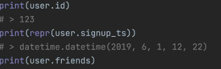
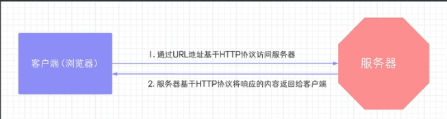
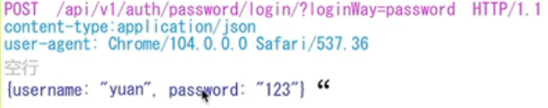
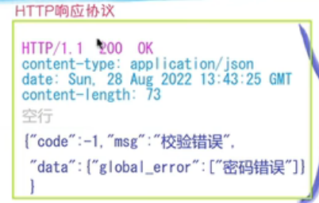
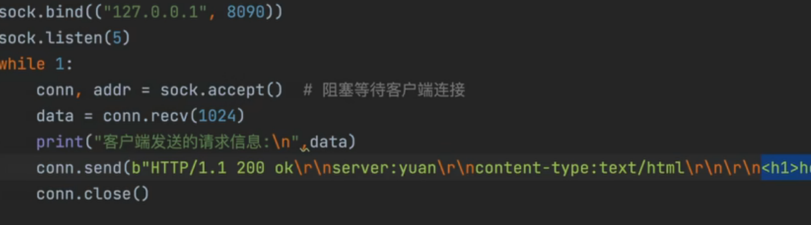
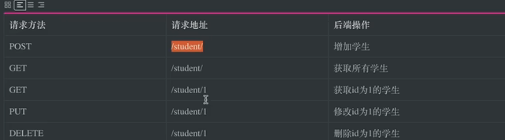
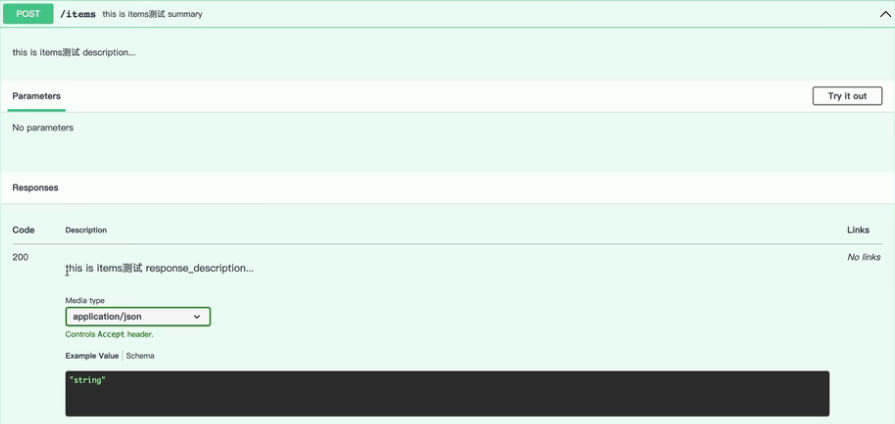

# pydantic
用来转化输入的类型 
```
from pydantic import BaseModel
class user(Basemodel):
    id: int
    name='TomoriNao'
    friends: list[int]=[]
external={
    'id':123,
    'friends':{1,2,'3'},
    }
user=User(**external)#**是按照标签传入 *是按照顺序传入
```


**注意 如果无法转化的类型 直接报错**

## http协议

用户传入url 基于http请求 向服务器发送申请 服务器基于http请求 发回一个页面

# http请求格式

# post和get请求区别
- GET请求会把得到的数据放在路径的后面
- POST请求会有一个专门的空间放数据

# http响应格式


而在socket进行响应时 也需要使用响应头的格式 否则无法正常输出


# restfuk 表征性状态转移

**面向资源开发** 不在路径中使用任何动作 而是以请求方式决定后端操作



# quick start

1.
```py
from fastapi import FastAPI

app = FastAPI()

@app.post('/')# 与flasky一致的装饰器方法 分为get put等等
async def home():
    return {"user_id":10001}
'''
# 路由里面可以给参数
#{tags=[''] 标题，
summary=总结
description=...
}
便于给前端人员看
'''
```

return 的部分就是返回的参数

如果不加async就是同步 跟flask几乎一模一样 那么加上async就是**异步操作** 这也是faskapi的优点

# 启动
uvicorn {x}:app --reload x写的名字 就可以启动 类似于flask里面的run（）

# 运行启动
```py
import uvicorn
uvicorn.run('name',port=8080，deubg=True,reload=True)
```

### docs
127.0.0.1.8080后面加上/docs 可以出现fastapi文档  便于观察请求头响应头等等

# 子路由
```
shop=APIRouter()
user=APIRouter()
@shop.route(...)
@user.route(...)

app=FastAPI（）
app.include_router(shop)
app.include_router(user)
```
一般写成多个类 最后合并

# 路径参数
在请求时给予参数 就能找到对于的路由/返回相应的响应头
```python
@app.route('/head/{id}')
def head(id):
    return {"user_id"=id}
# @app.route('/head/{id}')
#def head(id : int):
 #   ...
#类型声明 fastapi会自动转换（传入的id时str）
```
